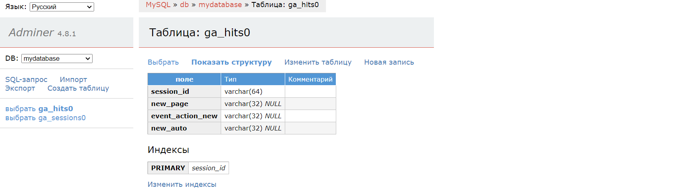
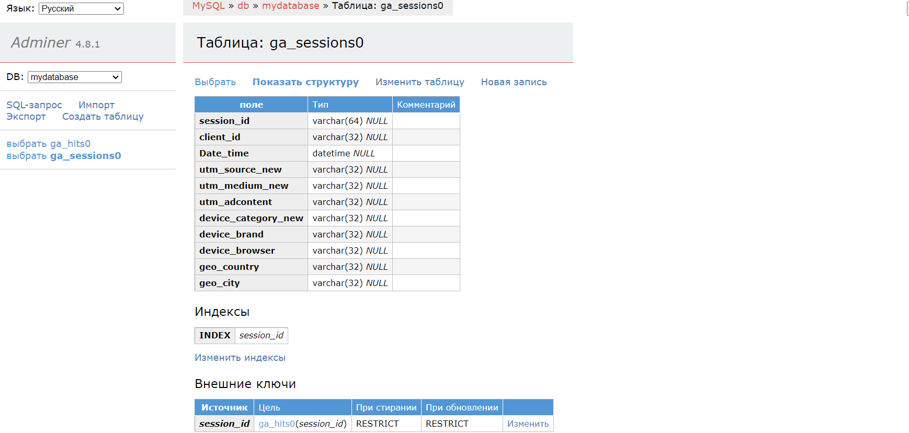
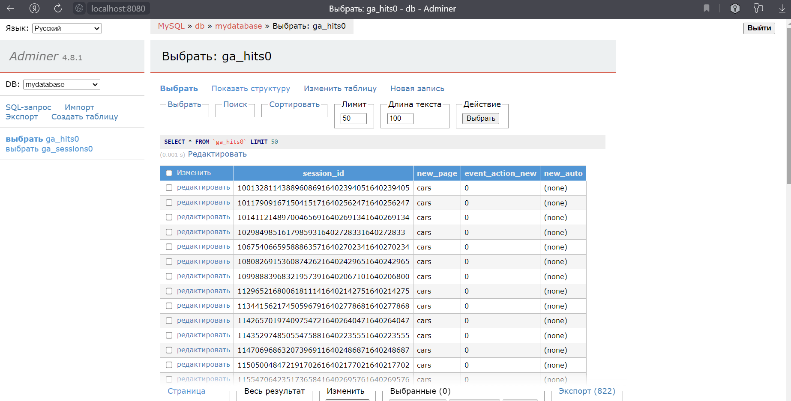
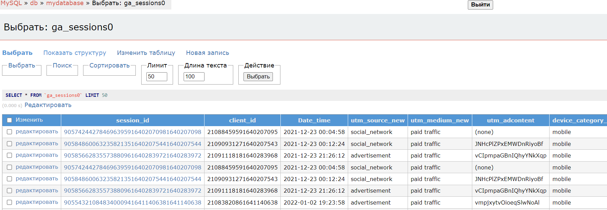

# Проект по очищению, преобразованию,систематизации и добавлению данных в БД MySQL для Анализа сайта «СберАвтоподписка»
### СберАвтоподписка» — это сервис долгосрочной аренды автомобилей для физлиц.

*Данные предоставлены из Google Analytics
(last-click attribution model) по сайту «СберАвтоподписка».


## <span style="color:red;"> Скрипт create_tables_to_sql.py </span>
```diff
Настраиваем и запускаем локальную БД, подходящую для хранения
и исполнения запросов к данных в предоставленном датасете.
-Настраиваем первичные и внешние ключи.
-Создаём объекты в БД для хранения данных исходного файла.
```



## <span style="color:red;"> Cкрипт ga_hits_to_sql.py , ga_sessions_to_sql.py </span>

```diff
-Производим базовую очистку (удаляем дубликаты,ненужные атрибуты,
обрабатываем пустые значения, применяем нужный тип данных).
- Помещаем в БД данные из предоставленного
основного датасета.
- Применяем механизм разрешения конфликтов при записи.
```




## <span style='color:red;'> Скрипт pipeline_ga_hits_json_to_sql.py, pipeline_ga_sessions_json_to_sql.py </span>

```diff
- Пайплайн, на вход берущий новые json-файлы
и успешно добавляющий их в существующие таблицы.
```

## <span style='color:red;'> Скрипт dag.py </span>

```diff
- Даг по созданию БД и заполнению исходных таблиц,
 который запускается только один раз.
- Даг с пайплайнами, на вход берущий новые json-файлы
и успешно добавляющий их в существующие таблицы.
```


# <span style='color:blue;'> ************************************** </span>
# <span style='color:blue;'> Дополнительная информация </span>
# <span style='color:blue;'> ************************************** </span>

### * <span style='color:green;'> Описание атрибутов  таблице ga_sessions: </span>
~ session_id — ID визита;
~ client_id — ID посетителя;
~ visit_date — дата визита;
~ visit_time — время визита;
~ visit_number — порядковый номер визита клиента;
~ utm_source — канал привлечения;
~ utm_medium — тип привлечения;
~ utm_campaign — рекламная кампания;
~ utm_keyword — ключевое слово;
~ device_category — тип устройства;
~ device_os — ОС устройства;
~ device_brand — марка устройства;
~ device_model — модель устройства;
~ device_screen_resolution — разрешение экрана;
~ device_brand — марка устройства;
~ device_model — модель устройства;
~ device_screen_resolution — разрешение экрана;
~ device_browser — браузер;
~ geo_country — страна;
~ geo_city — городv


### * <span style='color:green;'> Описание атрибутов в таблице ga_hits: </span>
~ session_id — ID визита;
~ hit_date — дата события;
~ hit_time — время события;
~ hit_number — порядковый номер события в рамках сессии;
~ hit_type — тип события;
~ hit_referer — источник события;
~ hit_page_path — страница события;
~ event_category — тип действия;
~ event_action — действие;
~ event_label — тег действия;
~ event_value — значение результата действияv